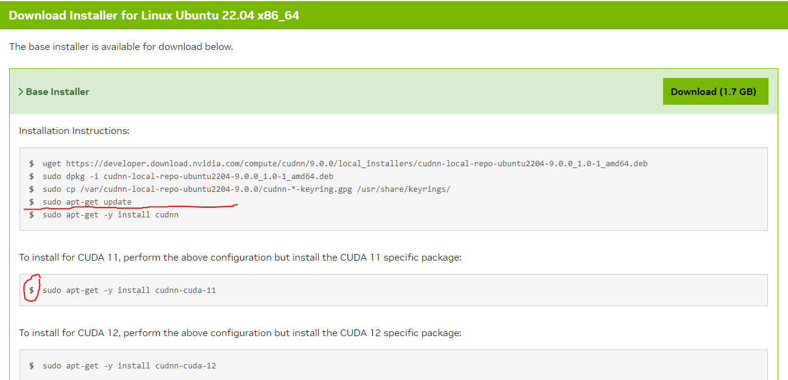
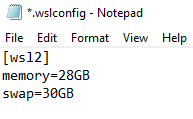

# CSC2102
SIT CSC2101 (Professional Software Development and Team Project 2)

# Installation on WSL2 (For Windows Systems)

## Requirements
1. Your Hyperviser is set to enable Windows Subsystem for Linux, otherwise see [here](https://learn.microsoft.com/en-us/windows/wsl/install) for me information on how to install WSL

2. An Nvidia GeForce GTX/RTX Graphics Processing Unit (GPU) or Graphics Card which is CUDA enabled

3. At least 16GB of RAM and a lot of swap space on disk

4. At least 8GB of VRAM on your graphics card with 16GB of shared memory swap space

5. Installed ```docker AND docker-compose``` or have ```docker desktop with wsl2 integration (Ubuntu)```

## Quick debugging checks
1. Run as admin in Windows Powershell, run wsl -l -v to check what sub-systems you have and ensure that they are version 2

2. Restart wsl by running ```wsl --shutdown``` and running it again or re-opening up Ubuntu (for example)


## Steps in wsl terminal
---Only execute step 2 and 3 for this section if running linux system---
1. Run Windows Powershell and enter into your wsl -- OR Run a distro of your choice from the Microsoft Store (i.e Ubuntu)

2. *Important*: Download [GeForce Experience](https://www.nvidia.com/en-sg/geforce/geforce-experience/download/) to acquire the latest Nvidia graphics drivers for your host machine specific Operating System

3. *Important*: Follow [these](https://developer.nvidia.com/cuda-downloads?target_os=Linux&target_arch=x86_64&Distribution=WSL-Ubuntu&target_version=2.0&target_type=deb_local) steps under the "> Base Installer" tab sequentially to install the necessary drivers to allow wsl/linux distro to interface to your GPU. Ensure that you choose the correct versions for your specific graphics drivers and Operating System

4. Run "nvidia-smi" on the terminal to confirm that the necessary drivers have been properly installed.

5. It is important to note that the NVIDIA cuda toolkit installation steps do not work as they install the newest versions of the toolkit for usage. However, it is very important to understand that Pytorch and Tensorflow is very sensitive to the version of the CUDA toolkit and cuDNN versions, in particular the newer versions or the installation will just NOT work and default to use the CPU instead. So make sure to install the proper version of the [CUDA toolkit 11.8.0](https://developer.nvidia.com/cuda-11-8-0-download-archive?target_os=Linux&target_arch=x86_64&Distribution=WSL-Ubuntu&target_version=2.0&target_type=deb_local) and [cuDNN 11.9](https://developer.nvidia.com/cudnn)

Skip the last step `sudo apt-get -y install cudnn` and move to the step to do `sudo apt-get -y install cudnn-cuda-11` instead. This is to make sure that you have consistent cuda drivers for the project, being at 11.8.0 for the toolkit.

6. Bring up Windows Powershell again and navigate yourself to the current User of the computer (i.e: C:\Users\Alice) folder and create a new file called [.wslconfig](./images/wslconfig_file.PNG)

This is to increase the amount of virtual memory for any WSL or docker containers depending on the size of the model/project you intend to use this for.

7. Configure the amount of memory and swap space as required such that the model is able to properly fit within the physical constraints available to your hardware

8. Restart wsl by running ```wsl --shutdown```

## Docker Setup For GPU usage

1. If you have yet to do so, use a web browser, download Docker-desktop from their [website](https://www.docker.com/products/docker-desktop/) and install ```docker``` and ```docker-compose``` to run the microservice containers, remember to also enable wsl integration with your distro and enable kubernetes in the settings as well.

2. Using wsl, check for successful installation by running ```sudo docker run --rm --runtime=nvidia --gpus all ubuntu nvidia-smi```, if a table like [this](./images/nvidiasmi.png) does not show up as an echo from your docker container, perhaps you have missed a step somewhere in the installation process. At bare minimum, you should be able to run nvidia-smi on your wsl terminal.

## Running the services

### Docker & Docker Compose
1. `cd CSC2102`

2. `docker-compose up -d`

3. Wait for the server to download the shard required for loading the model into your GPU.

4. `docker-compose down`

### Kubernetes
1. `cd CSC2102`

2. `docker-compose -f docker-compose-llm.yml up -d`

3. Create K8s namespace

    `kubectl apply -f ./namespace.yaml`

4. Start K8s replicasets and statefulsets

    `kubectl apply -f ./mariadb.yaml`

    `kubectl apply -f ./mongodb.yaml`

    `kubectl apply -f ./server.yaml`

5. Stop cluster

    `kubectl delete -f .`

    `docker-compose -f docker-compose-llm.yml down`

## Additional debugging
1. For debugging purposes on the model, either use ```docker logs llm``` (or container name), or ```docker-compose logs llm``` (or container name)

2. ```docker run --name llm -it -p 8080:8080 -v /path/to/mount/point:/server/data --gpus all *image_name* bash``` to run the container as a standalone for further debugging in the bash shell

## Process termination debugging
1. Monitor the processes using task manager, ```top``` or ```htop```  to see whether there is enough RAM for the model to be loaded into memory
2. Check your .wslconfig on the memory configuration size
3. Make sure to restart your wsl by running ```wsl --shutdown```
